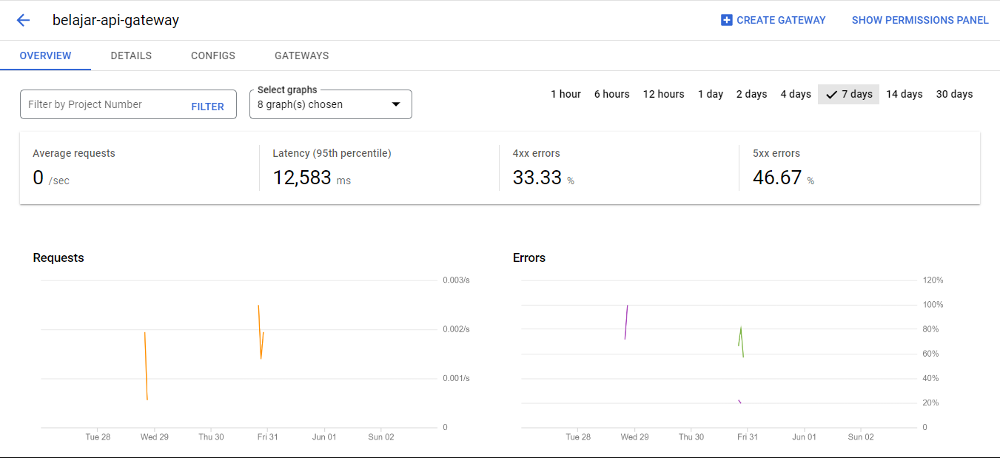
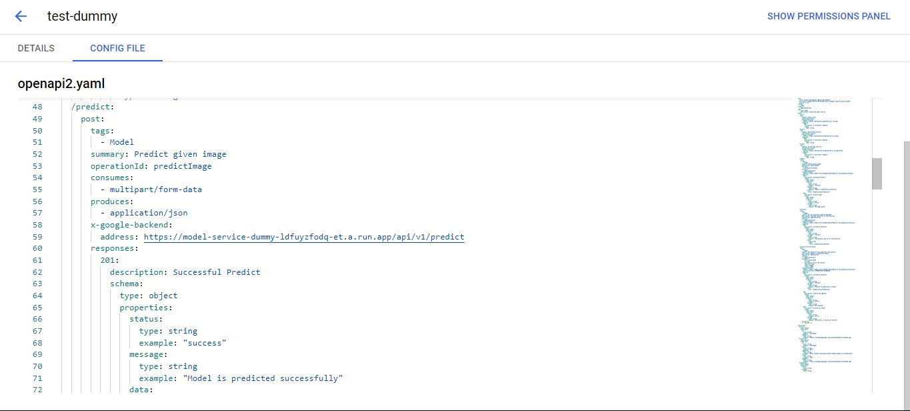
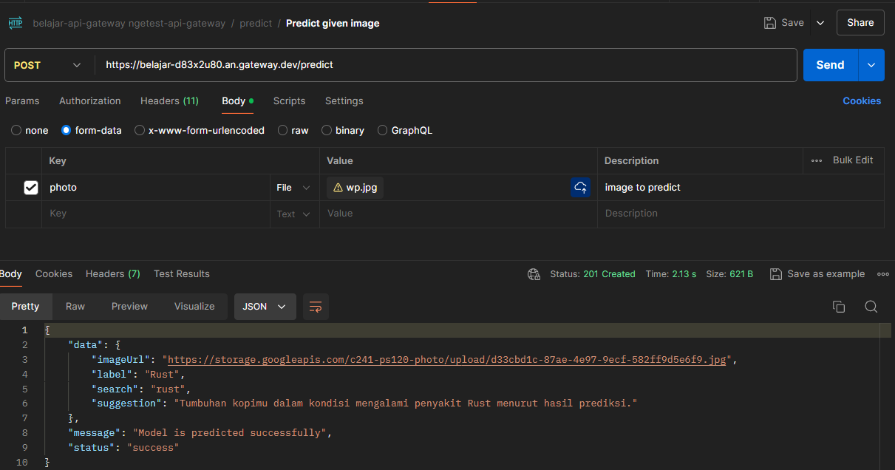

# bangkit-cloud-computing

Cloud Computing part of the capstone

## Week 2 - Septio Nugroho

- Create OpenAPI Specification Version 2.0 for Google Cloud API Gateway
- Deploy OpenAPI Specification to Google Cloud API Gateway (Dummy API)
- Test API Gateway to the Model API using Postman

#### API Gateway Overview

#### Config in API Gateway

#### Test API Gateway

